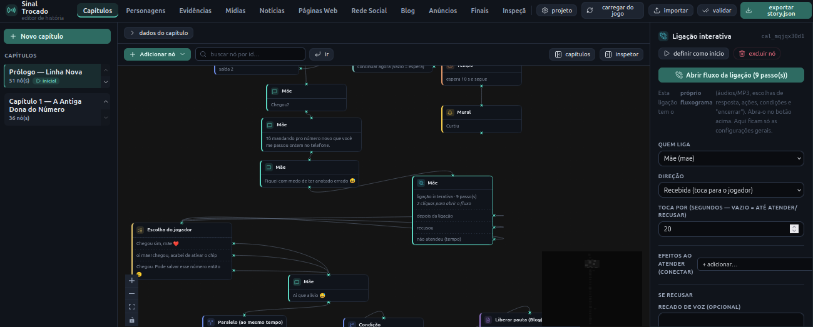
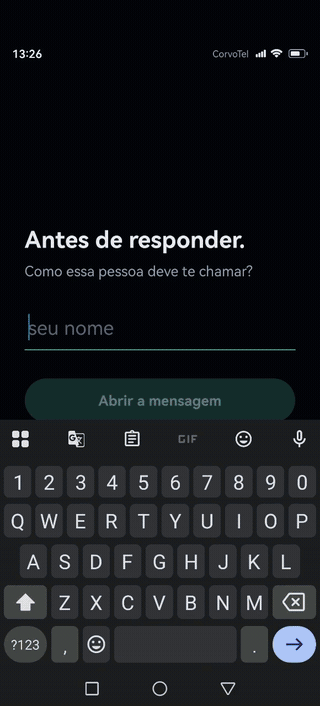

# Phone Narrative Game 📱

A **narrative mystery game** for Android (React Native + Expo) where **the player's phone _is_ the
game**. The whole story unfolds inside a fictional phone — texts, evidence, photos, audios, calls,
news, a social feed and choices. No combat, no puzzles, no fake timers. Just you, a buzzing phone,
and a mystery that pulls you in one message at a time.

The game is **100% data-driven**: the entire narrative lives in a single JSON file
(`src/story/story.json`) and is interpreted by a *Story Engine*. The screens hold **no story logic**,
so you can write and reshape whole chapters **without touching the code** — using the visual editor.

> The title, the cast and the chapters all come from `story.json` — this README is about how to
> **run** the project and how to **publish your story** into the app.

> **This project is open source, and you're warmly invited.** 💛 Whether you write, draw, compose,
> code, translate, hunt bugs or just want to play and tell us what felt off — there's a place for
> you here. See [**Contributing**](#8-contributing--youre-welcome-) below. No contribution is too
> small.

---

## 1. Prerequisites

- **Node.js 20 LTS or newer** (the project uses Expo SDK 54; Node 18 is no longer supported).
- **npm** (ships with Node).
- To play on a phone: the **Expo Go** app (Android) — or an **Android emulator** (Android Studio).
- Git (to clone the repository).

Check your Node version:

```bash
node --version   # must be >= 20
```

---

## 2. Run the game (the app)

```bash
# 1. clone and enter the folder
git clone <repository-url>
cd rpg

# 2. install dependencies
npm install

# 3. start the dev server (Metro/Expo)
npm start
```

With the server running:

- **On a phone:** open **Expo Go** and scan the QR code shown in the terminal (phone and computer on
  the **same Wi‑Fi network**).
- **On an emulator/connected device:** press **`a`** in the terminal — or run directly:

  ```bash
  npm run android
  ```

The game opens straight into an **unknown-number notification**: tap it, **enter your name and pick
your gender** (male/female — required, fixed for the run, and it can change lines and branches of the
story), and the investigation begins. No menus, no tutorial — the fiction is that it's a real phone.

> **Saves:** progress is stored on the device automatically. When the save format changes
> (`SAVE_VERSION` in `storyEngine.ts`), old saves are discarded and the game restarts from the
> onboarding.

---

## 3. The story editor (web panel)

The story is edited as a **visual flowchart** (Typebot-style) in [`editor/`](editor/) — a Vite/React
app that lives next to the game.

```bash
cd editor
npm install
npm run dev      # opens the panel in your browser (URL printed in the terminal, e.g. http://localhost:5173)
```

In the panel you edit, by tab:

- **Chapters** — the node flowchart (messages, choices, conditions, calls, notifications, chapter
  ends, and more).
- **Characters, Evidence, Media, News, Web Pages, Social, Blog, Ads, Endings** — the registries the
  nodes point to.

Handy while writing **messages**: type **`{{`** in the text to insert variables (`{{player_name}}`,
gender) or clickable **links** (fictional web pages, news articles, social posts and profiles), and
use the **emoji** button. Web pages that share a **domain** are grouped together, just for tidiness.

> The editor autosaves to your browser's `localStorage`. Closing the tab **won't lose** your work —
> but it also **doesn't** change the game. To change the game you must **export the JSON and replace
> it** (next section).

---

## 4. How to export the JSON into the app  ⭐

This is the one step that connects the editor to the game. The app reads **only**
[`src/story/story.json`](src/story/story.json); swapping that file changes the entire story, with no
code changes.

Step by step, inside the editor (`editor/` running with `npm run dev`):

1. **Load the current story** — the **`⟳ carregar do jogo`** button in the top bar. It imports the
   `src/story/story.json` currently in the project, so you start from what already exists.
   *(Skip this if you're starting fresh or were already editing.)*
2. **Edit** chapters and registries to your heart's content.
3. **Validate** — the **`✓ validar`** button. It flags integrity problems (broken links, references
   to ids that don't exist, etc.). **Only export when there are no errors** (warnings are optional).
4. **Export** — the **`⬇ exportar story.json`** button. Your browser downloads a `story.json` file
   (usually into **Downloads**).
5. **Replace the game's file:** move/paste the downloaded `story.json` over
   `src/story/story.json` (overwriting the old one).

   ```bash
   # example, from the project root:
   mv ~/Downloads/story.json src/story/story.json
   ```

6. **Validate again, this time in the project** (the official check that guards the app):

   ```bash
   npm run validate-story
   ```

   It must end with **`✓ História íntegra`**. If it reports an error, fix it in the editor and repeat
   from step 3.
7. **Reload the game:** if Expo is running, it recompiles automatically when the file is saved
   (or press **`r`** in the `npm start` terminal to reload).

> **Media is linked, not bundled:** photos, audio, video and avatars are **URLs** (`url`/`imageUrl`/
> `avatarUrl`) or items from the **Media** library. The JSON only stores the addresses — so the
> images/audio need to be hosted somewhere reachable on the internet.

---

## 5. Scripts

### App (project root)

| Command | What it does |
| --- | --- |
| `npm start` | Expo dev server (Metro) |
| `npm run android` | Runs on a connected Android device/emulator |
| `npm run typecheck` | Type check (`tsc --noEmit`) |
| `npm run validate-story` | Validates `story.json` integrity (graph references) |

### Editor (`editor/`)

| Command | What it does |
| --- | --- |
| `npm run dev` | Opens the editing panel in the browser |
| `npm run build` | Type check + production build of the editor |

---

## 6. Checks before publishing a change

When you change **code**, run:

```bash
npm run typecheck        # app types
npm run validate-story   # story integrity
```

To prove the app still bundles end to end (full bundle):

```bash
CI=1 npx expo export --platform android --output-dir /tmp/check
```

---

## 7. Project layout (at a glance)

```
src/
  story/story.json     ← THE ENTIRE STORY (what the app reads)
  types/               authored model (story.ts) and save model (game.ts)
  services/storyEngine.ts   pure interpreter of the narrative graph
  store/gameStore.ts   state (Zustand) + persistence
  screens/ components/ the screens/"apps" of the fictional phone
scripts/validateStory.mjs   story.json validator (npm run validate-story)
editor/                visual editing panel (Vite + React + React Flow)
docs/                  Game Design Document and production guide (SPEC kept private)
```

---

## 8. Contributing — you're welcome! 🤝

This is a labor of love, and it's better with company. Seriously: **if you've read this far, you're
already the kind of person we'd love to build with.**

Ways to help, big and small:

- 🐛 **Found a bug or something that felt off?** Open an issue — even "this message read weird to me"
  is gold.
- ✍️ **Writers & narrative folks:** the whole story is data in the editor — you can add chapters,
  branches and characters without writing a single line of code.
- 🎨 **Artists & sound:** avatars, evidence photos, audios and news images are all just links — drop
  in your assets.
- 🌍 **Translators:** authored text lives in the JSON; the UI strings live in the screens. Help bring
  the story to more people.
- 💻 **Developers:** TypeScript + React Native (game) and React/Vite (editor). Good first issues
  welcome.

Quick start for a code contribution:

```bash
# fork, then:
git clone <your-fork-url>
cd rpg
npm install
git checkout -b minha-melhoria
# ...make your changes...
npm run typecheck && npm run validate-story   # keep these green
# open a Pull Request 💌
```

Be kind, assume good intent, and have fun. We review PRs with care and we're happy to help you get
unstuck — don't be shy. **Thank you for being here.** 💛

---

## 9. Docs

- **[docs/GAME_DESIGN_DOCUMENT.md](docs/GAME_DESIGN_DOCUMENT.md)** — the game bible (lore,
  characters, systems, the truth of the case).
- **[docs/HISTORIA_ADMIN.md](docs/HISTORIA_ADMIN.md)** — production guide for the implemented story.

---

## 10. Common issues

- **QR won't connect / app won't load in Expo Go:** phone and computer must be on the **same
  network**. On networks that isolate devices, use tunnel mode: `npx expo start --tunnel`.
- **`npm install` fails over the Node version:** upgrade to **Node 20+** (see section 1).
- **`npm run validate-story` errors after exporting:** the exported `story.json` has a broken
  reference — open the editor, hit **`✓ validar`**, fix it, and export again.
- **I edited in the editor but the game didn't change:** the editor only affects the game after you
  **export the JSON and replace `src/story/story.json`** (section 4). Editing in the panel alone
  doesn't touch the app.
- **The emulator doesn't open with `a`:** make sure an emulator is running in Android Studio (or a
  device with USB debugging is connected) before pressing `a`.

---

## Architecture in one sentence

Authored JSON → a pure **Story Engine** (`src/services/storyEngine.ts`) → a Zustand store
(`src/store/gameStore.ts`) → the screens. The whole narrative is data; no screen holds story logic.

---

## Screenshots & demo 📸

**The story editor** — write the whole game as a visual flowchart, no code required:



**Gameplay demo** — the phone _is_ the game (20s preview):



> ▶️ Want the whole thing? [**Watch the full gameplay video here**](SCREENSHOTS/game-screen.mp4)
> (~4 min).
